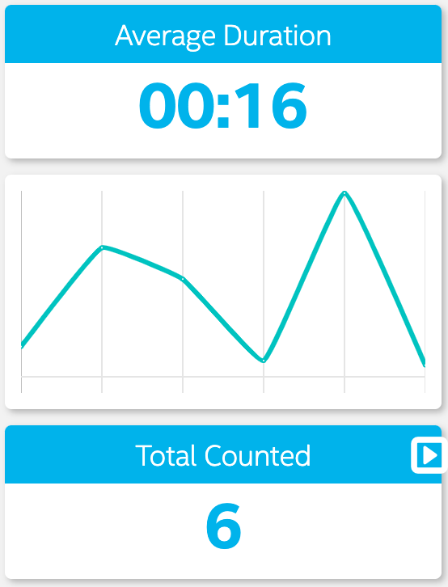
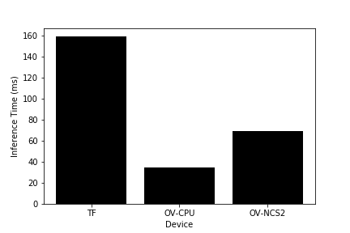
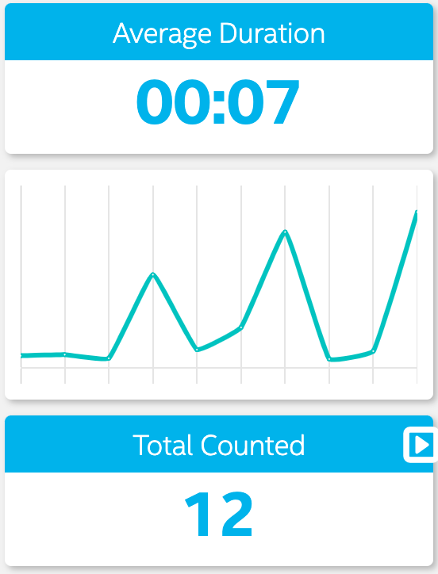
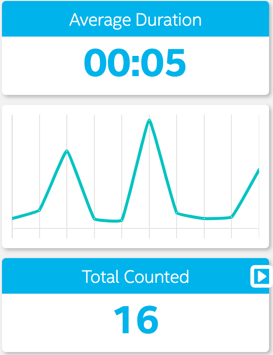
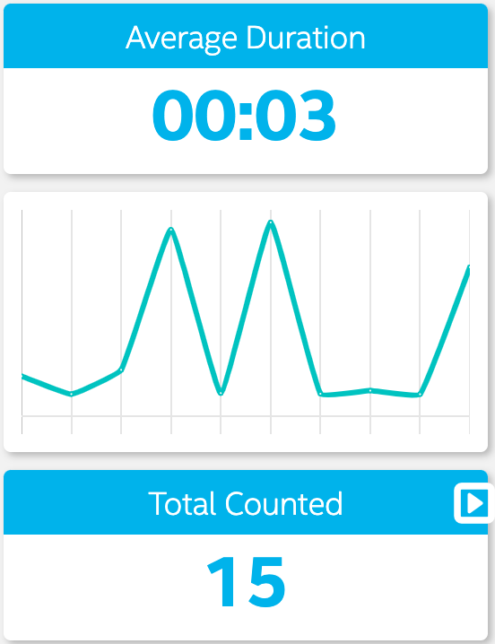

# People Counter

**Udacity Nanodegree - Project Write-up**

Alberto Torin

--- 

## Selected model and results

After trying without to success to find and convert to Intermediate Representation (IR) a suitable model, I ended up using the [`person-detection-retail-0013`](https://docs.openvinotoolkit.org/latest/_models_intel_person_detection_retail_0013_description_person_detection_retail_0013.html) model available in the OpenVINO model zoo. 

A detailed description of my attempts at converting and testing models is given in the last section.

### Running the App

It is possible to run the app with several underlying models without changing the main code. 
This can be achieved by selecting the `MODEL_FOLDER` first and passing it as a variable to the following command:

```bash
MODEL_FOLDER=person-detection-retail-0013
python3 main.py -i resources/Pedestrian_Detect_2_1_1.mp4 -m model/FP16/$MODEL_FOLDER/saved_model.xml -pt 0.6 | ./ffmpeg -v warning -f rawvideo -pixel_format bgr24 -video_size 768x432 -framerate 24 -i - http://0.0.0.0:3004/fac.ffm
```

### A Note on Durations

One possible method to extract how long a person appears in the video is by using the CPU time (and, in particular, with the `time.time()` function). 

Although simple enough, this approach can lead to large discrepancies in the results when the app is run on different devices (CPU, Neural Compute Stick 2, etc.).

To avoid these issues, one can look at the number of frames in which the person has been detected, and divide that by the video's frame rate (assuming a constant frame rate). In this way, computation times of different devices will not alter the final result.


### Results

The final statistics obtained on the provided test video are given in the following screenshot:



## Explaining Custom Layers

In some occasions, specific layers of a model might not be supported by OpenVINO. These layers are called _custom layers_. 

Handling custom layers in OpenVINO first of all requires to identify such layers. This can be done either empirically, while trying to convert a model into an IR, or programmatically, by looking at the layers supported by a specific device. 

Once identified, custom layers can be isolated from the optimised model and their computation can be offloaded to the CPU. 

This strategy allows to perform inference with an otherwise unusable model in OpenVINO, while at the same time trying to optimise at least some of its calculations. 

## Comparing Model Performance

Model performance has been compared for three different scenarios: The original Tensorflow model, run on a CPU, the optimised IR run on CPU and the same IR run on a Neural Compute Stick 2 (NCS2).

Tests were performed on a MacBook with 2.8 GHz Intel Core i7.

**Note: The following analysis has been performed using the `ssd_inception_v2_coco_2018_01_28` model.**

In order to compare the model before and after conversion to IR, I created a separate script to deal with the original Tensorflow model, while a function in the `main.py` file takes care of the IR models.

Test were performed on the following test image:


The difference between model accuracy pre- and post-conversion was negligible, with the following results (the first number represents the accuracy, while the other 4 are the bounding box. Notice how x and y coordinates are reversed in the original TF model.)

Tensorflow:

```
[0.9925442  0.52989864 0.39880767 0.770481 0.5286476 ]
```

OpenVINO IR on CPU:

```
[0.9893007  0.39436024  0.5280018 0.52694 0.7676021 ]
```

OpenVINO IR on NCS2:

```
[0.98828125 0.3942871 0.5283203 0.5263672 0.7685547 ]
```


The size of the model pre- and post-conversion was 210 Mb and 34 Mb respectively, considering the folder with all the files. 

The inference times of the model pre- and post-conversion is reported in the following graph.



A single inference with the original TF model requires 159 ms, while only 34 ms are required for the IR on a CPU. Surprisingly, inference on a NCS2 took twice as long (68 ms), but this is in line with [the results reported by other people](https://medium.com/@aallan/benchmarking-edge-computing-ce3f13942245). 


## Assess Model Use Cases

Some of the potential use cases of the people counter app are monitoring corridors or spaces with low traffic. The app might be able to identify unneeded loitering and raise alarm.

## Assess Effects on End User Needs

Lighting, model accuracy, and camera focal length/image size have different effects on a
deployed edge model. 

### Lighting Effects

An incorrect lighting of the scene will change the hue and brightness of the frames and likely result in missing detections and lower model performance. 

As an experiment, I tried to create a brighter version of the test video (available here under `resources/brighter_version_768x432.mp4`), and to feed it to the model.

As expected, using the `person-detection-retail-0013`, I obtained different statistics than the original version. 


### Camera Focal Length and Distance

The position of the camera is important to obtain good accuracy and will determine which model is better to use. 

In the test video, for example, the camera is placed from above, and the `person-detection-retail-0013` model is the perfect choice. 

When streaming the video from the laptop's camera, however, this model performs poorly with respect to `ssd_inception_v2_coco_2018_01_28`, for example. 

Placing the camera far from the scene reduces the size of the objects in the image, with potential blurrying effects, and might reduce the accuracy of a model.

## Model Research

In investigating potential people counter models, I first tried three models. 

All of them were found on the OpenVINO documentation page about [Converting Tensorflow models](https://docs.openvinotoolkit.org/2020.1/_docs_MO_DG_prepare_model_convert_model_Convert_Model_From_TensorFlow.html).

### Conversion command

After downloading the _tar_ file and decompressing it under the `models/tf_models` folder (not included in the repository for space limiations), I run the following commands to convert to IR:

```bash
MODEL_FOLDER=ssd_inception_v2_coco_2018_01_28
python /opt/intel/openvino/deployment_tools/model_optimizer/mo_tf.py --transformations_config /opt/intel/openvino/deployment_tools/model_optimizer/extensions/front/tf/ssd_v2_support.json --reverse_input_channels --saved_model_dir model/tf_models/$MODEL_FOLDER/saved_model/ --tensorflow_object_detection_api_pipeline_config model/tf_models/$MODEL_FOLDER/pipeline.config --output_dir model/FP16/$MODEL_FOLDER/ --data_type FP16
```

The variable `MODEL_FOLDER` must be specified appropriately for each model.

Note the `--transformations_config` parameter that replaces the deprecated `--tensorflow_use_custom_operations_config` in the latest OpenVINO versions.


### Models and performances

The models I tested with the app are the following:

- Model 1: `SSD Inception V2 COCO`
  - [Model Source](http://download.tensorflow.org/models/object_detection/ssd_inception_v2_coco_2018_01_28.tar.gz)
  - `MODEL_FOLDER`: ssd_inception_v2_coco_2018_01_28
  - The model was insufficient for the app because it failed to recognise the person in the video for several frames in a row.
  - I tried to improve the model for the app by playing with the postprocessing parameters, increasing the number of empty frames to allow, but still this could not fill in for the missing inferences.  
  
  

- Model 2: `SSD MobileNet V2 COCO`
  - [Model Source](http://download.tensorflow.org/models/object_detection/ssd_mobilenet_v2_coco_2018_03_29.tar.gz)
  - `MODEL_FOLDER`: ssd_mobilenet_v2_coco_2018_03_29
  - The model was insufficient for the app because, similarly to the previous case, there were too many missing inferences to fill in with postprocessing algorithms. The second and third person in the video were especially problematic to detect, with many correct detections below the 0.6 threshold.
  - I tried to improve the model for the app by increasing the number of empty frames, but eventually this model performed worse than the previous.

  

- Model 3: `SSD Lite MobileNet V2 COCO`
  - [Model Source](http://download.tensorflow.org/models/object_detection/ssdlite_mobilenet_v2_coco_2018_05_09.tar.gz)
  - `MODEL_FOLDER`: ssdlite_mobilenet_v2_coco_2018_05_09
  - Even this model showed a poor performance, with many missing inferences especially for the second person. 
  - In this case too, postprocessing techniques were not enough to fill in the missing detections.

  